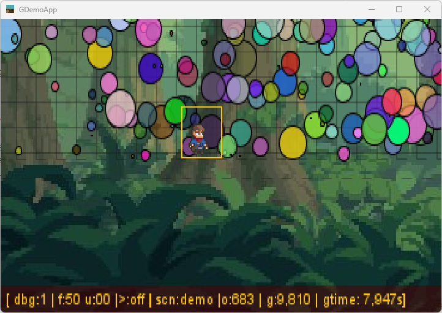

# README

This a test project to discover Gradle as a build tool through a playful game project.

The project bring some structured code with good patterns with only JDK 18 is used (see [.sdkmanrc](.sdkmanrc) file for
details)

## build

To build te a `game101` app, just execute the following command lien :

```bash
sdk env install
sdk env use
gradle build
```

## run

Simply execute the following command lien :

```bash
gradle run
```

And a new window will appear:



## develop

The git repo is controlled through the
standard [git flow](https://danielkummer.github.io/git-flow-cheatsheet/index.html "visit official git flow documentation")
process.

Basically, adding a new feature start with a:

```bash
git flow feature start [name-of-my-feature]
```

and will finish with a :

```bash
git flow feature finish
```

> _**Git Warning**_<br/>_This `feature finish` git flow operation will merge the corresponding feature branch into the
develop branch and delete the feature branch, locally AND remotely._

## Local documentation

for some detailed documentation, see the provided [/docs](docs/index.md) directory.

Bring:

- Some configuration though file and CLI,
- add logging capabilities,
- design a default graphics display,
- manage keys and mouse,
- bring entities to life,
- Physic engine,
- interaction with keyboard.

McG.
