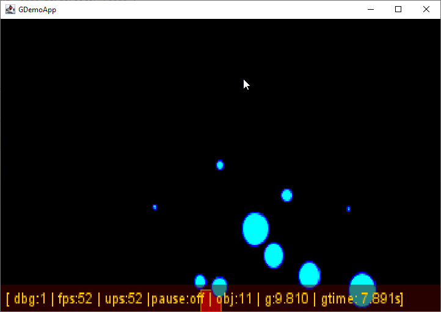
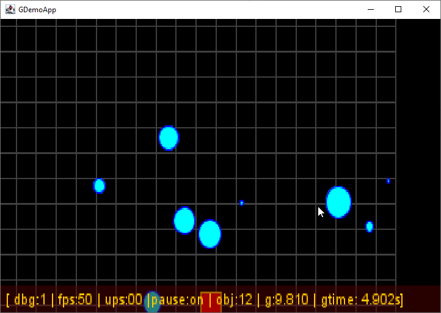

# Upgrade with GameObject and Plugin

## Goals

As we are going to enforce the entity model, we need to specialize the rendering pipeline to not let it become a Monster
Gaz plant and an unmaintainable class.

We also want to propose some specialized Entity to implement new graphical elements but also new behaviors and usages.

Let's move to some interesting changes, opening to more features and fancy things.

## Proposed evolution

To satisfy those goals, I need to move out from `Entity` to let it support the internals of our Renderer and entity's
identification or basic attributes like position.
But every thing else will move to a new class named `GameObject`.


### GameObject class

The GameObject class extending Entity intends to provide new attributes to offers new draw capabilities.

- a `type` field to propose multiple nature of object with a new enumeration `ObjectType`, proposing the following
  possible type values
    - POINT,
    - LINE,
    - RECTANGLE,
    - ELLIPSE
    - and IMAGE,
- an `image` attribute to store the image to be displayed in cas of `type=IMAGE`.
- the direction is added now but will be used at rendering time to draw the image in the right direction (Left=-1 or
  Right=1).

```java
public class GameObject extends Entity<GameObject> {
    //...
    public ObjectType type;
    public double direction;
    public BufferedImage image;
    //...
}
```

According to the new type attribute, the `updateBox()` method must be adapted to the new possibilities:

```java
public class GameObject extends Entity<GameObject> {
    //...
    public void updateBox() {
        switch (type) {
            case RECTANGLE, IMAGE, LINE, POINT -> {
                this.box = new Rectangle2D.Double(x, y, width, height);
            }
            case ELLIPSE -> {
                this.box = new Ellipse2D.Double(x, y, width, height);
            }
            default -> {
                // nothing to do !
            }
        }
    }
    //...
}
```

The type will be used by the `Renderer` plugin `DrawHelperPlugin` implementation to draw the `GameObject` in the right
way.

And to satisfy debug purpose with new type attribute values :

```java
public class GameObject extends Entity<GameObject> {
    //...
    public List<String> getDebugInfo() {
        //...
        infos.add(String.format("(1)id:%04d", this.id));
        infos.add(String.format("(1)name:%s", this.name));
        infos.add(String.format("(2)type:%s", type.toString()));

        //...
        return infos;
    }
    //...
}
```

### Entity update

To organize the rendering pipeline, we add 2 new attributes to the Entity to group by layer, and define some rendering
priority in one layer:

```java
public class GameObject extends Entity<GameObject> {
    //...
    private int layer;
    private int priority;
    //...
}
```

### The DrawHelperPlugin

Heart of our plugin implementation, this class defines the draw helper API: according to a specific object nature, its
class, the plugin must provide the right way to draw it.

```java
interface DrawHelperPlugin<T extends Entity> {
    void draw(Renderer r, Graphics2D g, T object);
}
```

The `draw()` method must remain very simple process on only focus on drawing. no update or complex branch switching. You
certainly noticed that the 3 parameters:

- `Renderer r`  to get a reference to other possible contextual information in the Renderer,
- `Graphics2D g` the Java 2D graphics API to draw things,
- `T object` the instance of the object to be drawn.

### The Renderer adaptation

The New Renderer `drawEntity()` method is now very simple, delegating draw operations to the right plugin, identified
it by the `e` Entity class instance nature::

```java

public class Renderer {
    //...
    private void drawEntity(Graphics2D g, Entity<?> e) {
        if (plugins.containsKey(e.getClass())) {
            DrawHelperPlugin<? extends Entity<?>> dhp = plugins.get(e.getClass());
            dhp.draw(this, g, e);
        }
    }
    //...
}
```

### The GameObjectDrawHelperPlugin

Let's hava a real example of a DrawHelperPlugin implementation for the new `GameObject` class:

```java
public class GameObjectDrawHelperPlugin implements DrawHelperPlugin<GameObject> {

    @Override
    public Class<GameObject> getEntityType() {
        return GameObject.class;
    }

    @Override
    public void draw(Renderer r, Graphics2D g, Entity<?> entity) {
        GameObject go = (GameObject) entity;
        switch (go.type) {
            //...
        }
    }

}
```

We need to define a clear process to draw each of the GameObject nature object:

- POINT, RECTANGLE and ELLIPSE will rely on the same
  processing, [fill](https://download.java.net/java/early_access/panama/docs/api/java.desktop/java/awt/Graphics2D.html#fill(java.awt.Shape))'
  in a basic [Shape](https://download.java.net/java/early_access/panama/docs/api/java.desktop/java/awt/Shape.html)
  object:

```java
  case POINT,RECTANGLE,ELLIPSE->{
        if(Optional.ofNullable(go.fillColor).isPresent()){
        g.setColor(go.fillColor);
        g.fill(go.box);
        }
        if(Optional.ofNullable(go.borderColor).isPresent()){
        g.setColor(go.borderColor);
        g.draw(go.box);
        }
        }
```

- while drawing a LINE will delegate it to
  the [drawLine](https://download.java.net/java/early_access/panama/docs/api/java.desktop/java/awt/Graphics.html#drawLine(int,int,int,int)) [Graphics2D](https://download.java.net/java/early_access/panama/docs/api/java.desktop/java/awt/Graphics2D.html)
  API,

```java
  case LINE->{
        if(Optional.ofNullable(go.borderColor).isPresent()){
        g.setColor(go.borderColor);
        g.drawLine((int)go.x,(int)go.y,
        (int)(go.x+go.width),(int)(go.y+go.height));
        }
        }
```

- and the IMAGE will call
  the [drawImage](https://download.java.net/java/early_access/panama/docs/api/java.desktop/java/awt/Graphics2D.html#drawImage(java.awt.image.BufferedImage,java.awt.image.BufferedImageOp,int,int))
  Graphics2D API to draw the image with the right direction:

```java
  case IMAGE->{
        if(go.direction>0){
        g.drawImage(go.image,(int)go.x,(int)go.y,null);
        }else{
        g.drawImage(go.image,
        (int)(go.x+go.width),(int)go.y,(int)go.x,(int)(go.y+go.height),
        (int)go.x,(int)go.y,(int)go.width,(int)go.height,
        null);

        }
        }
```

## The App adaptation.

Now the App class must provide GameObject and no more Entity in the create method:

```java
public class App {
    //...
    public void create() {
        //...
        // (1)
        var player = (GameObject) new GameObject("player")
                // (2)
                .setType(ObjectType.RECTANGLE)
                .setFillColor(Color.RED)
                .setBorderColor(new Color(0.3f, 0.0f, 0.0f))
                .setSize(16.0, 16.0)
                .setPosition((screenWidth - 32) * 0.5, (screenHeight - 32) * 0.5)
                .setSpeed(0.0, 0.0)
                .setAcceleration(0.0, 0.0)
                .setMass(80.0)
                .setDebug(1)
                .setMaterial(Material.STEEL)
                // (3)
                .setLayer(1)
                // (4)
                .setPriority(1);
        entityMgr.add(player);
        //...
    }
    //...
}
```

You can now see the setting of the new `GameObject`:

- (1) instantiate a `GameObject` instead of an `Entity`,
- (2) set its `ObjectType`,
- (3) define its rendering `layer`,
- (4) set the rendering `priority` in its layer.

Executing our new Plugin architecture will show the following window:



## Debugging Usage

Ok, we now understand how to specialize the rendering process for dedicated object. Let's implement a second
new `GameObject` variation with a visual `GridObject` which purpose is only using it at development and debugging time.

The GridObject principle is to draw a simple grid with a defined size at the top background of our play area, to
materialize this area and its size.


### the GridObject

The GridObject class is a very simple one adding some new attributes to the GameObject stepX and stepY:

```java
public class GridObject extends GameObject {
    private double stepX = 16.0;
    private double stepY = 16.0;

    public GridObject(String name) {
        super(name);
    }

    public GridObject setStepSize(double sx, double sy) {
        this.stepX = sx;
        this.stepY = sy;
        return this;
    }
    //... setters and getters
}
```

We also implement the mandatory constructor and a specific setter for define easily the step size on X and Y axis.

### The GridObjectDrawHelperPlugin

Now we add this new GridObject, we need to specialize the Renderer with a dedicated draw helper for this object nature.

```java
public class GridObjectDrawHelperPlugin implements DrawHelperPlugin<GridObject> {
    // (1)
    @Override
    public Class<?> getEntityType() {
        return GridObject.class;
    }

    // (2)
    @Override
    public void draw(Renderer r, Graphics2D g, Entity e) {
        GridObject go = (GridObject) e;
        g.setColor(go.borderColor);
        for (double x = 0; x < go.width; x += go.getStepX()) {
            g.drawRect((int) x, 0, (int) go.getStepX(), (int) go.height);
        }
        for (double y = 0; y < go.height; y += go.getStepY()) {
            g.drawRect((int) 0, (int) y, (int) go.width, (int) go.getStepY());
        }

    }
}
```

1. we define the class on which this plugin must be used for,
2. the `draw()` method is a very simple one, drawing rectangle based on a `GridObject` `width` and `height` and
   the `stepX` and `stepY` size with 2 for loops.

We now add this enw plugin to the Renderer:

```java
public class Renderer {
    public Renderer(Game g) {
        //...
        addPlugin(new GameObjectDrawHelperPlugin());
        addPlugin(new GridObjectDrawHelperPlugin());
    }
}
```

And in the `App` class, a `Game` interface implementation :

```java
public class App implements Game {
    public void create() {
        //...
        // Add a background GridObject as re visual reference
        entityMgr.add(
                new GridObject("grid")
                        .setStepSize(16.0, 16.0)
                        .setSize(
                                physicEngine.getWorld().getPlayArea().getWidth(),
                                physicEngine.getWorld().getPlayArea().getHeight())
                        .setBorderColor(Color.DARK_GRAY)
                        .setLayer(-1));
    }
}
```

Then, executing the new enhanced App class :

```bash
gradle run
```

You must see the following animated window :



## Conclusion

Finally, executing our new Renderer implementation is able to satisfy any new need without change the core Renderer draw
processing, and take benefits from all future GameObject descendants.


