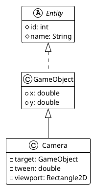

# Camera, Action !

# Camera Support

## Required

Add a `Camera` Object to move game view according to a target position in the game play area. the target must be
an `Entity`.

- add an smooth effect between target and the Camera move.

## Implementation proposal

The Camera object will drive the rendering view port to follow a `GameObject` `target`, with a certain delay fixed by
the `tween` factor value.

### The Camera object

The `Camera` class will inherit from `Entity` and introduce 3 new attributes:



- _target_ which is the target to be tracked by the camera,
- _tween_ the delay factor to make the camera follow target smoothly,
- _viewport_, a rectangle corresponding to the camera view port.

And the main `Camera` processing will be a dedicated computing on the target position, according to the tween delay
factor:

```text
cam.pos = cam.pos
    + (target.pos-(fov.size-target.size)) 
      x 0.5
      x tweenFactor
      x elpasedTime
```

So the update method in the Camera object will be :

```java
class Camera {
    //...  
    public GameObject update(double elapsed) {
        x += target.x - ((viewport.getWidth() - target.width)) * 0.5 * tween * elapsed;
        y += target.y - ((viewport.getHeight() - target.height)) * 0.5 * tween * elapsed;
    }
    //...
}
```

### The App with camera

TODO

### Add currentCamera to Renderer

TODO
