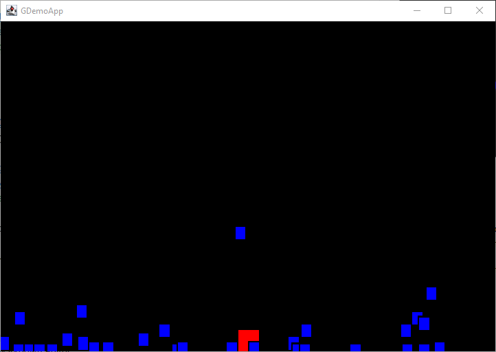

# Documentation

This small project intends to bring some Java basics to build up a Java application with a 2D Game goal.
Starting with Configuration, source of all project to a Game Loop, the project will move smoothly from basic java class
to a package organized project to provide Entity, physic, rendering, etc...

1. [The Game class](chapter-01-the_game_class.md)
2. [Java Enum as Configuration](chapter-02-java_enum_as_configuration.md)
3. [Start drawing with Renderer](chapter-03-start_drawing_with_renderer.md)
4. [Add keys and mouse](chapter-04-add_keys_and_mouse.md)
5. [Bring Entity and its manager](chapter-05-bring_entity_and_its_manager.md)
6. [Adding Physics](chapter-06-add_physic.md)

